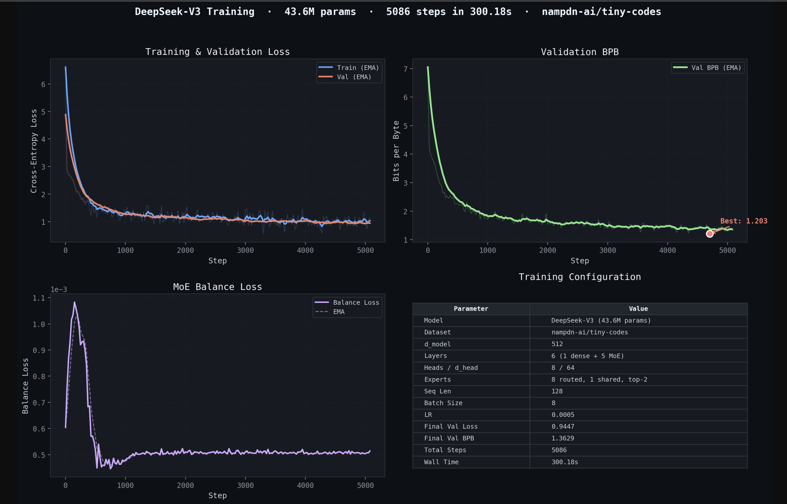

This repo is a toy reimplementation of DeepSeek-V3's core architecture, specifically its two signature innovations: Multi-head Latent Attention (MLA) and Mixture of Experts (MoE) built from scratch in PyTorch and trained on a small text dataset (TinyCodes).

The purpose was twofold:
- Understand the paper by building it. The model implements MLA (which compresses key-value projections into a low-rank latent space with a separate RoPE head) and MoE with a bias-based expert routing trick (instead of the usual auxiliary balance loss), both key contributions of the DeepSeek-V3 paper.
- Run an automated experiment loop to optimize it. A research-agent workflow (program.md) was set up where an AI agent iteratively tweaks hyperparameters and architecture choices in train.py, one change at a time, within a 5-minute training budget, keeping improvements and reverting regressions, all measured by validation bits-per-byte (val_bpb).

Used a H100 and opencode to run the entire loop.
Basic plotting can be done via `plot.py`.

### Links
- Model hosted on huggingface: https://huggingface.co/sachinkumarsingh/deepseek-v3-tiny
- Tiny-codes dataset: https://huggingface.co/datasets/nampdn-ai/tiny-codes
- Autoresearch: https://github.com/karpathy/autoresearch

### Training results

